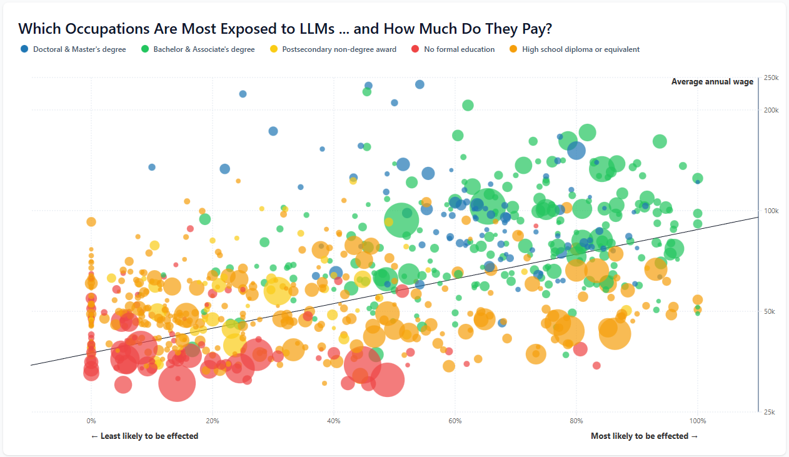

# LLM Exposure Scatterplot Demo

## Overview

This project renders an interactive scatterplot comparing LLM exposure to median annual wages across
occupations. It uses the 2024 OEWS exposure dataset and layers in education categories, employment
size, and a regression trendline to provide visual context.

## Screenshot



## Tech Stack

- **Svelte 5** + **SvelteKit** (SPA mode)
- **TypeScript**
- **LayerCake** for chart layout
- **D3** for scaling and regression helpers
- **Tailwind CSS** for styling

## Data Sources

- `static/data/oews_2024_gpt_exposure_soc2018.json`: Occupation-level exposure and wage data (fetched at runtime).
- `src/lib/types/occpoints.ts`: Type definition for occupation points.

## Visualization Encoding

- **X axis**: `exposure_human_gamma` (0–1), labeled as likelihood of being affected.
- **Y axis**: `median_annual_wage` on a log scale.
- **Point color**: education category.
- **Point size**: employment count (sqrt scale).
- **Trendline**: weighted log-space regression using employment as weights.

## Interactions

- **Hover**: tooltip shows occupation, income, probability, and employment.
- **Legend hover**: temporarily filters points and hides the trendline.
- **Legend click**: locks one or more categories; click again to clear.

## Development

Install dependencies and start the dev server:

```sh
npm install
npm run dev
```

## Quality Checks

```sh
npm run lint
npm run check
```

## Build

```sh
npm run build
npm run preview
```
